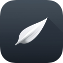
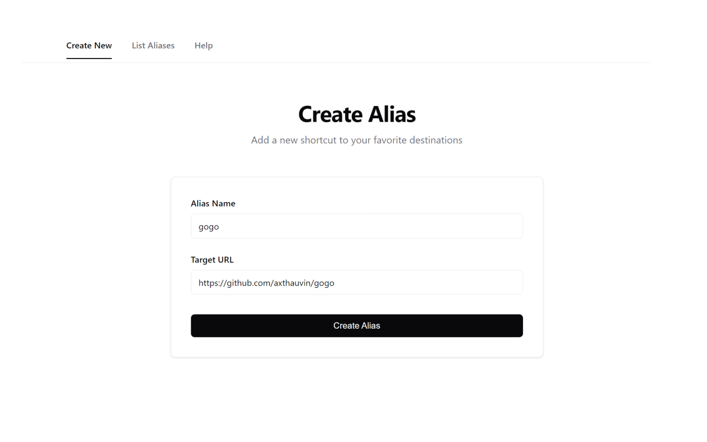
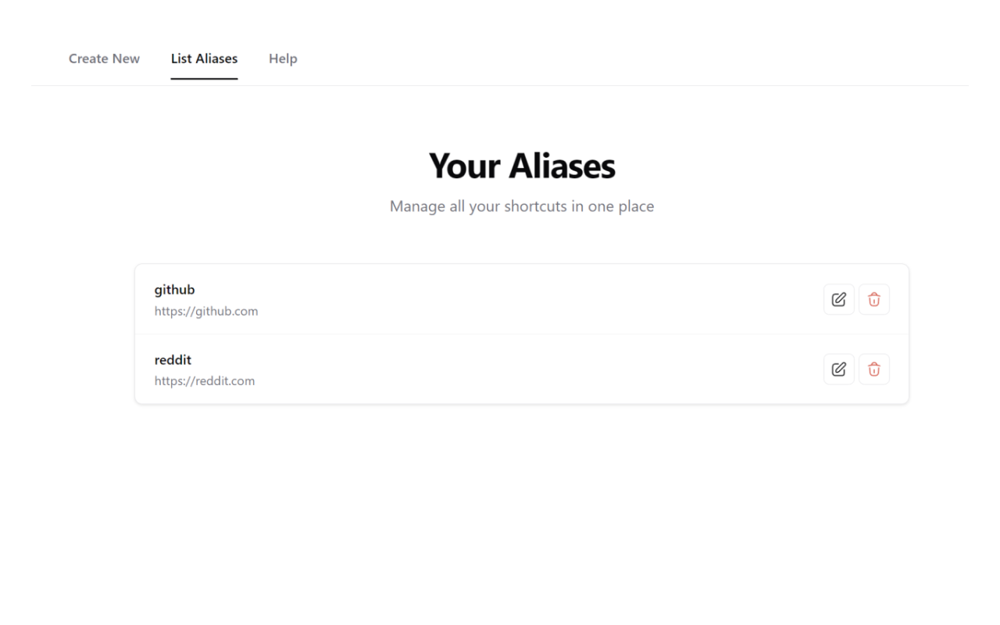

<div align="center">

# GoGo



**A browser extension that lets you create custom shortcuts to your favorite websites.**

[](https://chromewebstore.google.com/detail/gogo-%E2%80%93-your-shortcut-engi/paagjphnidjcdcekdhoelkmjhknfgiad)
[](https://addons.mozilla.org/fr/firefox/addon/gogo-web-shortcut-tool/)
[](https://github.com/Axthauvin/gogo/releases/latest)
[](LICENSE)

</div>

---

## What is GoGo?

GoGo transforms your browser's address bar into a powerful shortcut engine (its like VIM, but for your browser). Type **`go`** + **`space`** + **`your-shortcut`** to instantly navigate to any URL you've saved. No needs to click for your bookmarks !

---

## Quick Start

1. **Install the extension** (see [Installation](#-installation) below)
2. **Create your first shortcut**
   - Example: `gmail` → `https://mail.google.com`
3. **Use it!** Type `go gmail` in your address bar
4. **Press Enter** and you're there!

### Example Shortcuts

```
go gmail     → https://mail.google.com
go gh        → https://github.com
go drive     → https://drive.google.com
go ty   → https://youtube.com
go red    → https://reddit.com
```

---

## Screenshots

<div align="center">

### Create New Shortcuts



### Manage Your Shortcuts



</div>

---

## Installation

### Chrome / Edge / Brave

#### Option 1: Chrome Web Store (Recommended)

[🔗 Install from Chrome Web Store](https://chromewebstore.google.com/detail/gogo-%E2%80%93-your-shortcut-engi/paagjphnidjcdcekdhoelkmjhknfgiad)

#### Option 2: Manual Installation

1. Download the [latest release](https://github.com/Axthauvin/gogo/releases/latest)
2. Extract the `chrome-dist` ZIP file
3. Open `chrome://extensions/` in your browser
4. Enable **Developer mode** (toggle in top-right corner)
5. Click **Load unpacked**
6. Select the `dist-chrome` folder
7. Done! 🎉

### Firefox

#### Option 1: Firefox Add-ons (Recommended)

[🔗 Install from Firefox Add-ons](https://addons.mozilla.org/fr/firefox/addon/gogo-web-shortcut-tool/)

#### Option 2: Manual Installation

1. Download `gogo-firefox.xpi` from the [latest release](https://github.com/Axthauvin/gogo/releases/latest)
2. **Drag and drop** the `.xpi` file into your Firefox window
3. Click **Add** when prompted
4. That's it! ✅

> The Firefox extension is **officially signed** by Mozilla! No configuration changes needed!

---

## 🛠️ Development

### Prerequisites

- Node.js (only to build)
- npm or yarn or pnpm
- Git

### Setup

```bash
# Clone the repository
git clone https://github.com/Axthauvin/gogo.git
cd gogo

# Install dependencies
npm install

# Build for all browsers
npm run build
```

### Project Structure

```
gogo/
├── .github/workflows/
└── src/
    ├── background/
    ├── core/
    ├── icons/
    │   └── socials/
    ├── modules/
    │   ├── import-export/
    │   ├── search/
    │   ├── shortcuts/
    │   └── theme/
    ├── pages/
    ├── styles/
    ├── ui/
    │   ├── components/
    │   └── forms/
    └── utils/
```

### Build Commands

```bash
# Build for all browsers
node build.js all

# Build for Chrome only
node build.js chrome

# Build for Firefox only
node build.js firefox
```

### Testing Locally

**Chrome/Edge/Brave:**

1. Run `node build.js chrome`
2. Open `chrome://extensions/`
3. Enable Developer mode
4. Click "Load unpacked" and select `dist-chrome`

**Firefox:**

1. Run `node build.js firefox`
2. Open `about:debugging#/runtime/this-firefox`
3. Click "Load Temporary Add-on"
4. Select any file in `dist-firefox`

---

## Contributing

Contributions are welcome! Whether it's bug reports, feature requests, or code contributions, all help is appreciated.

### How to Contribute

1. **Fork the repository**
2. **Create a feature branch**
   ```bash
   git checkout -b feature/amazing-feature
   ```
3. **Make your changes**
4. **Commit with clear messages**
   ```bash
   git commit -m "Add amazing feature"
   ```
5. **Push to your fork**
   ```bash
   git push origin feature/amazing-feature
   ```
6. **Open a Pull Request**

### Reporting Bugs

Found a bug? Please [open an issue](https://github.com/Axthauvin/gogo/issues/new) with:

### Feature Requests

Have an idea? [Open an issue](https://github.com/Axthauvin/gogo/issues/new) and describe:

- The problem you're trying to solve
- Your proposed solution
- Why it would be useful

---

## 📝 Roadmap

- [x] Publish to Chrome Web Store
- [x] Publish to Firefox Add-ons
- [x] Export/Import shortcuts
- [x] Dark theme
- [x] Search accross the shortcuts
- [ ] Sync shortcuts across devices
- [ ] Shortcut categories/tags
- [ ] Usage statistics

---

## 📄 License

This project is licensed under the MIT License.
See the [LICENSE](LICENSE) file for details.

---

## ❤️ Support

If you find GoGo useful, please consider:

- Starring the repository ⭐
- Reporting bugs
- Suggesting features
- Contributing code
- Sharing with friends

---

<div align="center">

Made with ❤️ by [@axthauvin](https://github.com/Axthauvin)

**[Install Now](#-installation)** • **[Report Bug](https://github.com/Axthauvin/gogo/issues)** • **[Request Feature](https://github.com/Axthauvin/gogo/issues)**

</div>
